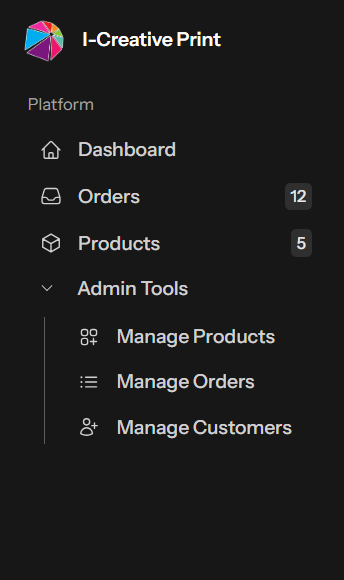
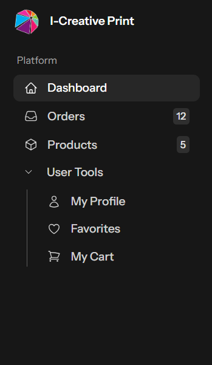
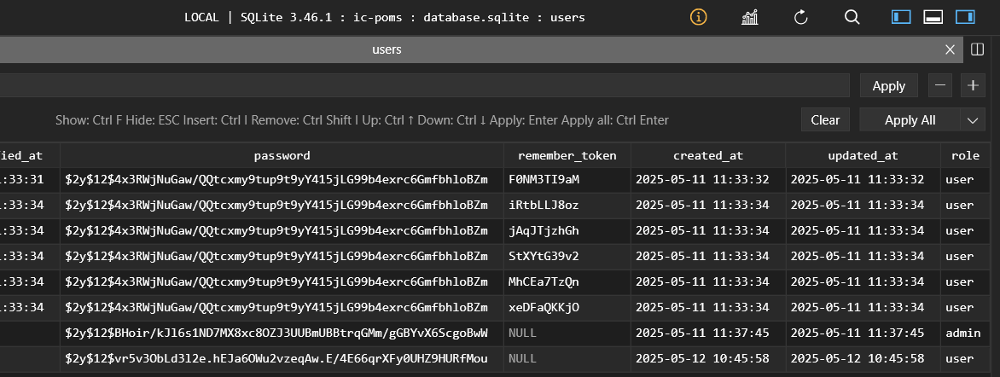
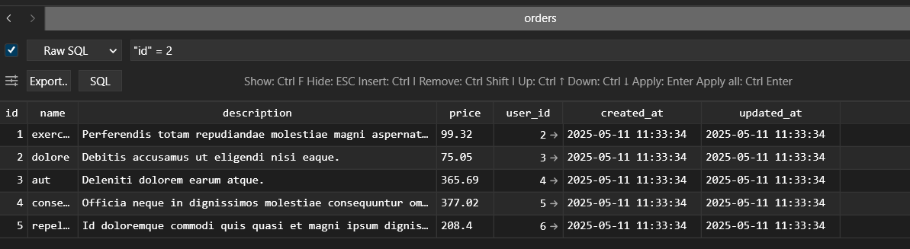
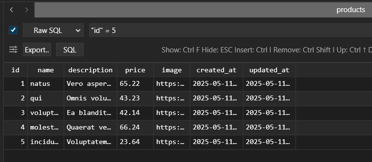
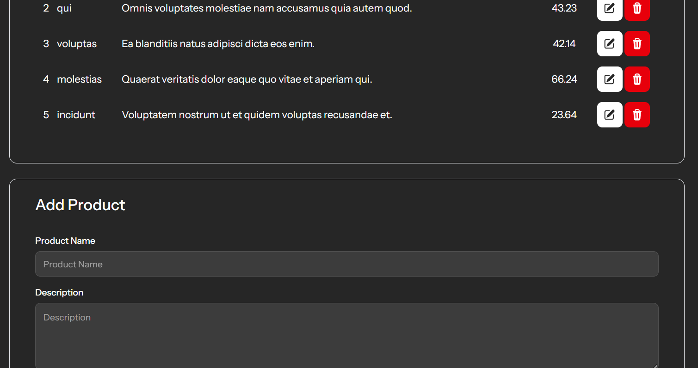

Interface:

changes 1:
--update favicon title
--add auth login

changes 2:
--change to split auth login

    
changes 3:
--update sidebar
--update title header
--add new logo image

changes 4:
--add user sidebar
--add admin sidebar + admin dashboard
--add column role to user table

changes 5:
--create product table
--create order table
--create relational table (user->order->product)

changes 6:
--create product page with crud

changes 7:
--did UI for product page(user)

changes 8:
--created temporary form for Create order page(user)